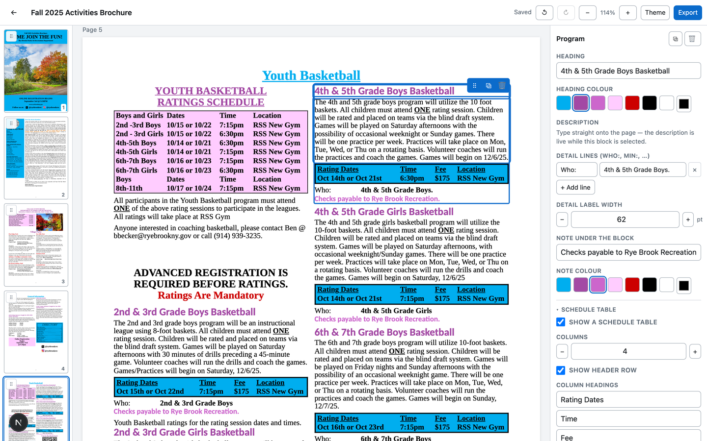

# Brochure Maker

**[rye-brook-brochure-maker.vercel.app](https://rye-brook-brochure-maker.vercel.app)**

Build the Rye Brook Parks &amp; Recreation activity brochure in a browser and
export it as a print-ready PDF.

Three past seasons ship with it, already rebuilt as editable pages — duplicate
one, change the dates and fees, and export. Any other PDF can be brought in and
made editable too. There is no sign-in: open the link and start working.



---

## What it does

**Start from a past season.** Fall 2025, Spring/Summer 2026 and Winter 2025-26
are all included. Pick one, rename it, and edit.

**Bring in any PDF.** Drop in a brochure and every page comes back with its
artwork intact and all of its text turned into blocks you can retype. A
fourteen-page brochure converts in about a minute.

**Edit on the page.** Click a block and type where the text sits. Select words
to make them bold, italic, underlined, or a different color.

**One palette drives everything.** The brand colors live in *Theme*; changing
one restyles every block that uses it, across every page.

**The canvas is the PDF.** The editor and the exporter render the same
components through the same stylesheet, so what you see is what prints.

**It warns before it breaks.** A page whose content runs past the bottom is
flagged in the canvas and in the page rail, instead of silently dropping a
paragraph from the PDF.

**Autosave, undo, and history.** Edits save about a second after you stop
typing, with full undo/redo and periodic restore points. Deleting is soft —
nothing is destroyed.

**Everything syncs.** Work on a laptop, pick it up on an iPad. Photos and
imported pages go to cloud storage; the documents live in Postgres.

**It works on a tablet.** Below 900px the page rail and the inspector become
bottom sheets, touch targets grow, and dragging waits for a short press so the
page still scrolls normally.

## Getting started

```bash
npm install
npm run dev
```

That is enough to try it. With no configuration, brochures are saved to
`.data/brochures.json` on your machine and the home page says so.

To sync across devices, copy `.env.example` to `.env.local` and fill in the two
Supabase values. To create the tables in a fresh Supabase project, run
`supabase/schema.sql` in its SQL editor.

For **Download PDF**, Google Chrome must be installed — the app reuses it rather
than downloading its own copy. **Print / Save as PDF** works either way, since it
goes through your own browser.

## Exporting

*Export* offers three things:

| | |
|---|---|
| **Download PDF** | Renders `/print/[id]` in headless Chromium. Real vector text with embedded fonts, 8.5×11 Letter, no margins. |
| **Print / Save as PDF** | Opens the same page in a print dialog. Use this on an iPad — choose *Save to Files*. |
| **Save a .json backup** | The whole document. *Import* on the home page restores it. |

## How importing a PDF works

A PDF records *where ink was placed*, not what the author meant by it. Rebuilding
a full block structure from that is guesswork, and guessing wrong silently
rearranges someone's document. So the import splits each page in two:

1. Everything that is not text — photos, table fills, rules, logos, borders — is
   kept exactly as drawn, by rendering the page and using it as the page
   background.
2. Every run of text is lifted off into a real, editable block placed at the
   coordinates the PDF gave it. The background under each run is painted out with
   the color that surrounds it, so the original glyphs do not ghost through once
   the text is edited.

You get a page that looks like the original and whose words can all be retyped,
restyled, moved, or deleted.

Conversion runs in the browser, not on the server: a fifty-page PDF is far more
work than a serverless function should take on, and the browser already has
everything needed to do it. Nothing in the importer throws — a page that cannot
be parsed still lands as its own rendered image, so the worst case is a faithful
page that is not editable, rather than a failed import.

## How it is put together

```
src/lib/types.ts        The document model: pages, blocks, placement, theme
src/lib/theme.ts        Color tokens, fonts, page geometry
src/lib/doc.ts          Block factories, defaults, migrations
src/lib/store.ts        Editor state and undo history
src/lib/db/             Supabase, with a local JSON fallback
src/lib/import/pdf.ts   PDF -> editable document
src/lib/seed/           Fall 2025, hand-built from blocks
src/lib/templates/      The New menu, including the two imported seasons

src/components/render/  Shared by the editor and the PDF — the single source
                        of truth for how a page looks
src/components/editor/  Selection, drag-and-drop, inspector, overlays

src/app/print/[id]      Chrome-free render, screenshotted by the exporter
src/app/api/export      Headless Chromium -> PDF
```

A **document** is a list of pages; a page is a list of blocks. Blocks lay out one
of two ways:

- **Flowed** — stacked down a one- or two-column grid, so lengthening a paragraph
  pushes what follows. The hand-built templates work this way, and it is the
  reason this is an editor rather than a free canvas.
- **Placed** — pinned to fixed coordinates. Imported pages land this way. Either
  kind can be switched to the other from the inspector.

**Colors are tokens.** A block stores `@purple`, not `#A349A4`, and resolves it
against the theme at render time — which is why one palette change restyles the
whole brochure.

### Fidelity

The Fall 2025 template was rebuilt from the original PDF with the type scale,
column geometry and line spacing measured off the source rather than guessed:
10pt Times on a 10.56pt line, 3.55in columns with a 0.12in gutter, 14pt Calibri
headings. `npm run audit:layout <id>` re-checks every page for content past the
sheet edge or table cells that wrap, and reports all fourteen clean.

Word's fonts are substituted with metric-compatible open faces — Tinos for Times
New Roman, Carlito for Calibri, Cinzel for Castellar — so line breaks land where
they did in the original.

## A note on access

This app has no accounts and no login. That is deliberate: it is an internal tool
for a small group who all work on the same brochures, and a sign-in wall would
cost them more than it protects. The database policies and the storage bucket are
open to the anonymous key on purpose, not by oversight.

The practical consequence is that **anyone with the URL can read and change every
brochure**. If that stops being acceptable, the place to fix it is the Supabase
policies in `supabase/schema.sql` plus a login in front of the app — the storage
layer behind `src/lib/db` does not need to change.

## Scripts

| Command | |
|---|---|
| `npm run dev` | Development server |
| `npm run build` | Production build |
| `npm run seed` | Create the Fall 2025 brochure in the current store |
| `npm run typecheck` | `tsc --noEmit` |
| `npm run lint` | ESLint |
| `npm run audit:layout <id>` | Report pages that overflow or wrap |
| `npm run shots <id> [dir]` | Render every page to PNG |
| `npm test` | Sanitizer security tests |
| `npm run make-template <pdf> <slug> "<Title>"` | Run a PDF through the importer and bundle the result as a template |

## Known limits

- The menorah on the Winterfest panel of the Fall 2025 template is vector art in
  the original and could not be extracted; the panel carries only the tree image.
  Drop a replacement onto the block to restore it.
- On an imported page, the artwork behind the text is a picture. The words on top
  are fully editable, but the shapes behind them are not.
- Version snapshots are taken every twentieth save and on export, not on every
  keystroke.
